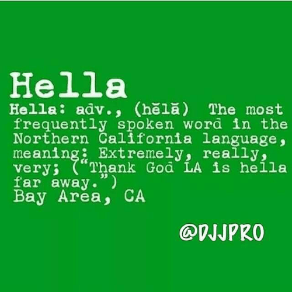

Every language has rules. This is true for spoken languages as well as software languages. The English language has a large document of its rules: the dictionary. It defines all of the words that can be used. It provides examples of how to use each word. For the most part, we all agree upon these rules when we speak with one another.

GraphQL is a language. It also has a dictionary, but we refer to this dictionary as the language specification or the spec. 

So, what is a spec? A spec describes the capabilities and characteristics of a programming language. We benefit from language specifications because they supply a common vocabulary and best practices for the community's use of the language. GraphQL is a specification for client-server communication. For the most part, we all agree upon the rules outlined in the GraphQL spec when we build client-server applications with GraphQL. The [GraphQL specification](https://facebook.github.io/graphql/) is no where near the size of the Oxford Dictionary. You can read it in a day.

A fairly notable example of a software spec is the ECMAScript spec. Every once in a while, a group of representatives from browser companies, tech companies, and the community at-large get together and devise what should be included in (and left out of) the language. The same is true for GraphQL. A group of individuals got together and wrote what should be included in (and left out of) the language. This then serves as a guideline for all of the implementations of GraphQL. 

The GraphQL spec describes the language and grammar that should be used when writing GraphQL documents. These rules include: how to draft queries, how schemas should be defined, and how to validate GraphQL syntax. It defines the rules for the GraphQL query language as well as the Schema Definition Language. Beyond that, the spec isn't particularly bossy. GraphQL doesn't dictate which software language to use, how the data should be stored, or which clients to support.

Every group who speaks English may have a different style or approach to talking. This is true of countries, regions, and even social groups. When speaking to your friends, you may use words and phrases that are not defined in the dictionary. Not only do you still understand each other, but these nuances arguably allow you to understand each other better. You and your friends have your own way of implementing the English language. 

The West Coast term "hella" was recently added to Webster's dictionary. <a href="https://me.me/i/hella-hella-adv-chela-the-most-frequently-spoken-word-in-14419542">meme via me.me</a>

The same is true for software implementations including GraphQL implementations. Each implementation agrees upon the rules defined in the GraphQL spec, but they also may have their own way of spicing up GraphQL. Each implementation decides upon which software language to use. They may use different approaches or design patterns when implementing GraphQL. Implementations can also add their own GraphQL features. For example, the GraphQL specification does not define a solution for file transfer, but Apollo Server 2.0 includes an `Upload` scalar out of the box. Sometimes these experimental features can become a part of the main specification.

The number of GraphQL tools and implementations will continue to expand, but with a good understanding of the spec, you'll be positioned well to work with any GraphQL tool that comes along.