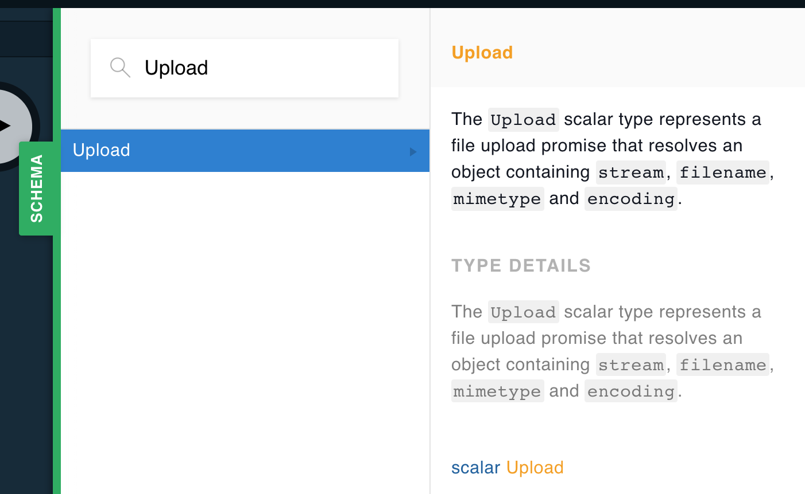

We don't have a mailbox. The postman will not deliver mail to us where we live. We know. We were mad about it too before we realized that we get a free PO BOX at the local post office. All of our mail and all of our packages are delivered through one tiny box. Our PO BOX handles letters just fine. They can easily be delivered and collected through this box. However, packages present a different problem. The mail carrier cannot put our packages inside of our tiny mailbox. Instead they store the package in a large locker and leave a small key inside of our PO BOX. We collect the key and use it to find and unlock the locker that stores our package.

What does any of this have to do with GraphQL? A GraphQL request is kind of like our PO BOX. It has limitations. Specifically, we can only send and receive data that can be parsed as JSON text in a GraphQL operation. Just like our PO BOX handles letters without issue, GraphQL handles sending and receiving text without issue.

Files are the problem. We cannot send a file as a GraphQL argument. Files are too big. Like packages sent to us in Tahoe City, GraphQL requires a special solution to handle files. The solution is very similar to how we receive large packages. The file is stored somewhere else and the instructions on where to obtain the file is passed to the GraphQL API.

## The Server

If you've been using Apollo Server, you already have a solution built in for handling uploads. When you create your schema, the Apollo Server adds a custom scalar type called `Upload`. Go ahead, open your favorite Apollo GraphQL API in the Playground and search for a type called `Upload`. Are you surprised that it is there?



We can use this type to pass files to our GraphQL APIs. This allows us to handle uploads directly in GraphQL. For example, let's say I wanted to build a mutation that collected a file from the client. I can add the `Upload` type to any mutation argument that I choose:

```graphql
type FileStats {
  filename: String!
  mimetype: String!
  filesize: Int!
}

type Mutation {
  submitAFile(file: Upload!): FileStats!
}
```

In this example, we created a mutation called `submitAFile`. It expects a `file` argument that is of the `Upload` type. The `submitAFile` mutation will return statistics about the uploaded file in a custom type called `FileStats`.

The Apollo Server incorporates a package called [graphql-upload](https://github.com/jaydenseric/graphql-upload) (previously `apollo-upload-server`). This package will retrieve files from the `Upload` scalar and pass the file stream in a Promise directly to your resolver:

```javascript
Mutation: {
  submitAFile: async (_, { file }) => getFileDetails(file);
}
```

By the time the `file` argument makes it to the above mutation, it is ready to work with. We can capture the read stream, and use it to save the file wherever we like. The above example sends the file argument directly to the `getFileDetails` function which returns a Promise that resolves to the `filename`, `mimetype`, and `filesize` of the `file`:

```javascript
const getFileDetails = file =>
  new Promise(async (resolves, rejects) => {
    const { filename, mimetype, createReadStream } = await file;

    let filesize = 0;
    let stream = createReadStream();

    stream.on("data", chunk => {
      filesize += chunk.length;
    });

    stream.once("end", () =>
      resolves({
        filename,
        mimetype,
        filesize
      })
    );

    stream.on("error", rejects);
  });
```

The above function `getFileDetails` takes in a Promise as an argument, the `file`, and returns a Promise. The first thing we do is wait for the `file` Promise to resolve. When it does, we will already have the `filename` and `mimetype` of the file. That is two thirds of the information that we need to resolve the `FileStats` type. We also need to obtain the `filesize`. For that, we have to use the `createReadStream` function to create a readable file stream. The file stream can be used to save the file locally or pipe it to a cloud service like an S3 bucket. In our case, we are using the stream only to figure out the full size of the file.

Read streams raise `data` events every time they read a `chunk` of binary data. We can listen to these data events and total the file size by adding up the size of each chunk that we received. When a stream is finished, it will raise an `end` event. Once this event occurs, we know the stream has finished reading all of the chunks so we can resolve the `filename`, `mimetype`, and full `filesize`. This data will be passed back to the client from the `submitAFile` resolver.

So whenever we want to upload a file, we can use the `Upload` type that ships with the Apollo Server. It will pass the mechanism to obtain that file in a promise directly to the resolver.

## The Client

When we make HTTP requests, the client encodes the data sent along with in the request body. Typically the POST data is encoded using `application/x-www-form-urlencoded` or `application/json`. These options are like our PO BOX, they both handle small bits of data as text just fine. However when we want to send a file from the client we must encode our POST data as `multipart/form-data`. This is equivalent to adding lockers for large packages to our POST requests. The `multipart/form-data` encoding gives us a way to pass files along with text data. Perhaps you've seen this on an HTML form that includes a file input: `<form enctype="multipart/form-data">`.

The `graphql-upload` package has a counterpart: [apollo-upload-client](https://github.com/jaydenseric/apollo-upload-client). Apollo Upload Client provides us with a function to use to create a link that can handle sending files over the network. It makes sure our post requests are encoded as `multipart/form-data` which allows the client to pass files along with the request.

The `createUploadLink` function will create an `ApolloLink` that works like the `HttpLink`, but additionally it supports file uploads:

```javascript
import { ApolloClient, InMemoryCache } from "apollo-boost";
import { createUploadLink } from "apollo-upload-client";

const link = createUploadLink({ uri: "http://localhost:4000" });
const cache = new InMemoryCache();

const client = new ApolloClient({ cache, link });
```

The above code configures an `ApolloClient` instance that can upload files. You do not need to also include the `HttpLink`. The link created with `createUploadLink` is an HTTP link that can handle all of your existing queries and mutations.

When you want to upload a file from the client, it is important to make sure that you are actually sending the file. JavaScript provides a pretty robust API for dealing with files on the client. In our case, we are going to use the `file` input type to allow our users to browse their file system to select the file that they wish to upload:

```javascript
<input
  type="file"
  onChange={e => {
    const [file] = e.target.files;
    mutation({
      variables: { file }
    });
  }}
/>
```

File input types have a field called `files`. This field, found in `e.target.files`, contains an array of files. It is possible to upload more than one file at once. Since we are only uploading one file at a time are using array destructuring to obtain the first `file` from the array. Now that we have the `file`, we can pass it in the mutation. Here is an example of the full component used to send the `submitAFile` mutation to our API:

```javascript
import React from "react";
import { gql } from "apollo-boost";
import { Mutation } from "react-apollo";

const UPLOAD_MUTATION = gql`
  mutation submit($file: Upload!) {
    submitAFile(file: $file) {
      filename
      mimetype
      filesize
    }
  }
`;

export default function UploadForm({ onComplete = f => f }) {
  const mutationComplete = (cache, { data }) =>
    onComplete({
      size: data.submitAFile.filesize,
      name: data.submitAFile.filename,
      type: data.submitAFile.mimetype
    });

  return (
    <form>
      <Mutation mutation={UPLOAD_MUTATION} update={mutationComplete}>
        {mutation => (
          <input
            type="file"
            onChange={e => {
              const [file] = e.target.files;
              mutation({
                variables: {
                  file
                }
              });
            }}
          />
        )}
      </Mutation>
    </form>
  );
}
```

The above component uses the `Mutation` component to send the mutation that uploads the file. When a user selects a file with the "browse" button, the mutation is invoked, and the selected file is sent to the mutation as an argument called file. The `apollo-upload-client` link handles the rest. It makes sure that the file, and instructions on where to find the file, are sent to the server. When the `Upload` scalar is parsed on the server it will use those instructions to find the file and pass it to the resolvers. Magic? Yes, exactly. But just like any good magic trick, we can figure out how it works.

## How It All Works

Packages do not fit in our PO BOX, but we are given a key to obtain our package. Written on the side of the key is a locker number, the only locker that the key can unlock. We use this locker number to identify the locker, unlock it, and obtain our package.

The `apollo-upload-server` and `graphql-upload` packages work much the same way. Like the Post Office, the `apollo-upload-server` places the file in the body of the request and provides a map, or key, that `graphql-upload` can use to find the file and associate it with the correct argument.

The best way to see how this works is to build a web page with HTML and vanilla JavaScript. Within this page, we can send the file in the body of a `fetch` request and provide a `map` that will be used to associate the file with the correct operation variable. Start by creating a simple html page that contains an `<input type="file" />` form element:

```html
<!DOCTYPE html>
<html lang="en">
  <head>
    <meta charset="utf-8" />
    <link rel="stylesheet" href="styles.css" />
    <meta
      name="viewport"
      content="width=device-width, initial-scale=1, shrink-to-fit=no"
    />
    <title>Vanilla Upload Sample</title>
  </head>
  <body>
    <h1>upload a file with vanilla javascript</h1>
    <a href="/">upload with react-apollo</a>
    <input id="file-to-upload" type="file" onchange="sendFile()" />
    <div id="results"></div>
    <script src="uploadFile.js"></script>
  </body>
</html>
```

Notice that the above code contains an `input` element that invokes a function called `sendFile` when its value changes. That means when the user selects a file the `sendFile` function will be invoked. The `sendFile` function is defined in `uploadFile.js`:

```javascript
// A reference to the input element that will contain the file
const inputFile = document.getElementById("file-to-upload");
const results = document.getElementById("results");

// The function that is invoked when a user selects the file
async function sendFile() {
  // Capture the first file from input element
  const [theFile] = inputFile.files;

  // The mutation that will be used to upload the file
  const query = `
    mutation upload($file: Upload!) {
        submitAFile(file: $file) {
            filename
            mimetype
            filesize
        }
    }
  `;

  // The operation contains the mutation itself as "query"
  // and the variables that are associated with the arguments
  // The file variable is null because we can only pass text
  // in operation variables
  const operation = {
    query,
    variables: {
      file: null
    }
  };

  // This map is used to associate the file saved in the body
  // of the request under "0" with the operation variable "variables.file"
  const map = {
    "0": ["variables.file"]
  };

  // This is the body of the request
  // the FormData constructor builds a multipart/form-data request body
  // Here we add the operation, map, and file to upload
  const body = new FormData();
  body.append("operations", JSON.stringify(operation));
  body.append("map", JSON.stringify(map));
  body.append(0, theFile);

  // Create the options of our POST request
  const opts = {
    method: "POST",
    body
  };

  // Send the fetch request to the API
  // Parse the response as json and obtain the resulting data
  const { data } = await fetch("http://localhost:4000/graphql", opts).then(
    res => res.json()
  );

  // Render the results of the submitAFIle mutation
  // With plane old JavaScript
  showStats(data.submitAFile);
}

// A function to reset the form so users can add another file
function reset() {
  inputFile.style = " display: block; ";
  results.innerHTML = "";
}

// A function that displays the results on the page
function showStats({ filename, mimetype, filesize }) {
  inputFile.style = " display: none; ";
  results.innerHTML = `
    <p>
      <b>name</b>: ${filename}
    </p>
    <p>
      <b>type</b>: ${mimetype}
    </p>
    <p>
      <b>size</b>: ${filesize} bytes
    </p>
    <button onclick="reset()">upload another file</button>
  `;
}
```

The key to the above solution is the `map` variable. The map variable is a JavaScript object that tells the server where to find any files associated with mutation variables. In this case, it is telling the server that there is a file saved under "0" in the request body that should map to the `file` argument found in the variables. The body of the httpRequest contains the GraphQL operation, the map, and the file saved under "0".

You can see the full solution with both the Apollo Client and the Vanilla JavaScript client in this repository: [How the Upload Scalar Works](https://github.com/MoonTahoe/how-upload-scalar-works). No files are actually uploaded. We are using the upload stream to calculate the full file size only. However, this code could be easily modified to store the file in a location of our choosing.

We can't receive packages in our PO BOX. They are too large. A GraphQL server cannot receive files in `variables`. The `variables` that are associated with a query, mutation, or subscription, are parsed as JSON. Files are too large to parse and send this way. However, just like my post office has a workaround that allows me to still receive my package, the Apollo Server incorporates a workaround so that your resolvers can still receive files.

_For more information on the `Upload` type, check out Chapter 7 of our book, [Learning GraphQL](http://shop.oreilly.com/product/0636920137269.do)._