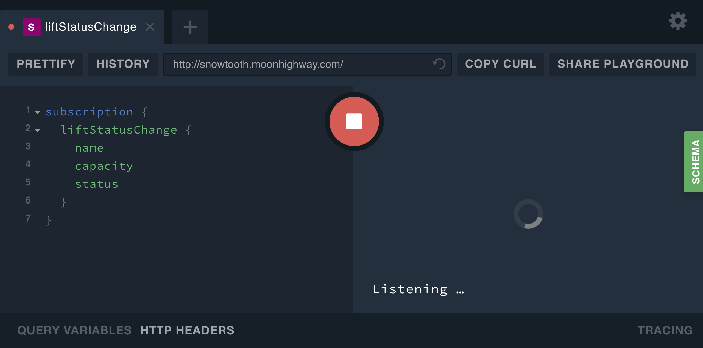
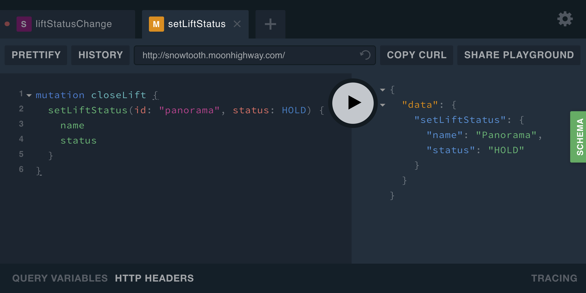
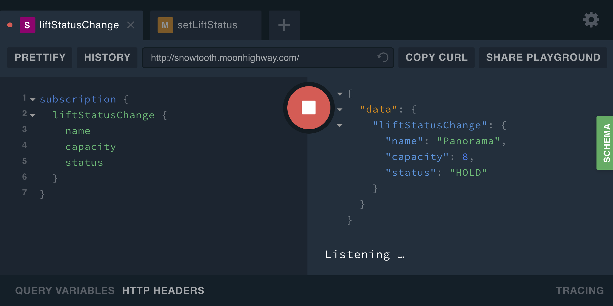

<i style="font-size:8px">^^ get it... listening?</i>

On the tech timeline, GraphQL is pretty new. Whenever something is new, there is __FOMO__: fear of missing out, and some developers rush to learn the new thing. Other developers believe that the technology they already have is good and try everything they can to reject the new thing. These people have __FOFO__: fear of finding out. They have FOFO that the new thing might be useful or even better.

If you run across a person with a case of FOFO about GraphQL, they're not wrong. They just aren't ready to find out yet. You might be able to cure them of this affliction by showing them GraphQL subscriptions.

Queries let us ask for data. Mutations let us change data. Subscriptions let us listen for data changes in real time, and let's be honest, subscriptions are extremely cool.

Subscriptions in GraphQL came from a real-life use case at Facebook. The team wanted a way to show real-time information about the number of likes (Live Likes) that a post was getting without refreshing the page. This functionality is powered by subscriptions. Every client is subscribed to the like event and sees likes being updated in real time.

Just like the `Mutation` and the `Query`, a `Subscription` is a root type. Data changes that clients can listen to are defined in an API's schema as fields under the `Subscription` type.

Let's take a closer look at a subscription built in to the Snowtooth API. Snowtooth is a real API for a fake ski resort. A `Lift` and a `Trail` are the key types. We can listen for the status change of a ski lift with a subscription.

```graphql
type Subscription {
  liftStatusChange: Lift
}
```

Writing the GraphQL query to listen for a subscription is also similar to how we would define other operations. If you'd like to follow along, head over to http://snowtooth.moonhighway.com, and place this subscription in the left panel:

```graphql
subscription {
  liftStatusChange {
    name
    capacity
    status
  }
}
```

When we run this subscription, we will listen for lift status changes over a WebSocket. Notice that clicking the play button in GraphQL Playground doesn't immediately return data. This is because running a subscription starts a process that will return data every time there is a change.



In order to see data pushed to the subscription, we need to make a change. We have to open a new window or tab to send that change via a mutation. Once a subscription operation is running in a GraphQL Playground tab, we cannot run anymore operations using the same window or tab. You can open a new tab to add the mutation.

From the new window or tab, let's send the `setLiftStatus` mutation:

```graphql
mutation closeLift {
  setLiftStatus(id: "panorama", status: HOLD) {
    name
    status
  }
}
```



When we run this mutation, the status of Panorama will change and the `name`, `capacity`, and `status` of the Panorama lift are pushed to our subscription. Panorama is the last lift that has changed and the new status is pushed to the subscription.



Unlike queries and mutations, subscriptions remain open. New data will be pushed to this subscription every time there is a status change on a chairlift. To stop listening for status changes, you will need to unsubscribe from your subscription. To do this with the GraphQL Playground, simply press the stop button.

Not only do GraphQL subscriptions provide a way to handle real-time use cases in our projects, they can be easily tested with GraphQL Playground. When planning your apps, consider situations where the request and response cycle might not be dynamic enough. Don't be afraid of finding out how alive your apps can feel with GraphQL subscriptions.