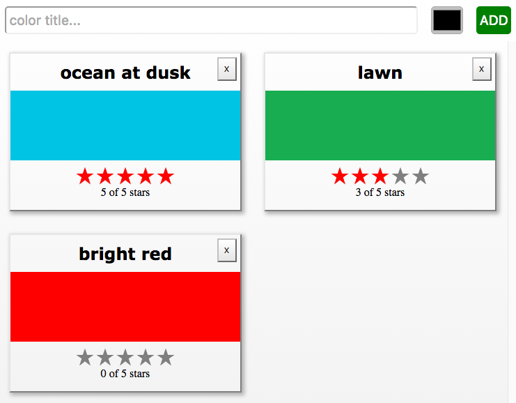

In Spring 2017, we released our first [O'Reilly book](http://shop.oreilly.com/product/0636920049579.do), _Learning React_. On the day that I heard they were sending the final version of the book to the printer, I made one simple request on Twitter:

<blockquote class="twitter-tweet" data-lang="en"><p lang="en" dir="ltr">This is being sent to the printer this week! React and related library maintainers: please don&#39;t change anything for 5-ish years. Deal? 😀😎 <a href="https://t.co/njHdsKv6bf">https://t.co/njHdsKv6bf</a></p>&mdash; Eve Porcello (@eveporcello) <a href="https://twitter.com/eveporcello/status/856646889772466176?ref_src=twsrc%5Etfw">April 24, 2017</a></blockquote>
<script async src="https://platform.twitter.com/widgets.js" charset="utf-8"></script>

I thought this was very reasonable. Don't change anything for 5 years. Well, two years later a lot has changed, and to be fair, I was warned:

<blockquote class="twitter-tweet" data-lang="en"><p lang="en" dir="ltr">but if we don&#39;t you won&#39;t have an excuse to write a second edition! 🙃</p>&mdash; Sophie Alpert (@sophiebits) <a href="https://twitter.com/sophiebits/status/857470144338984960?ref_src=twsrc%5Etfw">April 27, 2017</a></blockquote>
<script async src="https://platform.twitter.com/widgets.js" charset="utf-8"></script>

Clearly, no one listened to my tweet but for good reason. As React evolves, it continues to get better. We can leverage the new benefits by incorporating new patterns into our existing applications. In the first edition of the book, we built an app called the Color Organizer. It's an app that allows people to add, edit, and delete from their list of favorite colors. A key feature of the app was ratings where people could select a star rating for each color.

Let's take a look at the Color Organizer as it was in the first edition, and then we'll upgrade it to use the latest syntax for the second edition of the book that will come out later this year. (And yes, that is a nonchalant announcement that we are working on a 2nd edition of _Learning React_, which will contain a fresh update of all of the content. It's going to be awesome.)

The UI for the Color Organizer looks like this:



There are several components at work here, but let's focus on the `<StarRating />` component:


The rating is made up of 2 components: the `<StarRating />` and the `<Star />`. We need a way to track whether the star is selected to determine the rating. We also need to allow users to click on a star to apply a specific rating. Finally, we want to assign a value for a total number of stars so that this component could be used in apps where there was a 4 star rating, 5 star rating, 10 star rating, etc.

In the book, we used a class component for the `StarRating` and a function component for the `Star`. The `Star` looked like this:

```javascript
const Star = ({ selected = false, onClick = f => f }) => (
  <div className={selected ? 'star selected' : 'star'} onClick={onClick} />
);
```

The `Star` has two properties: `selected` and `onClick`. If `selected` is false, it will have a `className` of `star` meaning that it will be gray instead of red. When clicked, the `onClick` method is invoked.

Next, let's look at the `StarRating`. This component will render the number of `Star` components from the `totalStars` property. When clicked, each `Star` will trigger the `change` method which will set the state of `starsSelected`. As is typical of class components, we need to handle setup in the constructor: setting an initial state and then binding `this` for the `change` event.

```javascript
class StarRating extends React.Component {
  constructor(props) {
    super(props);
    this.state = {
      starsSelected: 0
    };
    this.change = this.change.bind(this);
  }

  change(starsSelected) {
    this.setState({ starsSelected });
  }

  render() {
    const { totalStars } = this.props;
    const { starsSelected } = this.state;
    return (
      <div className="star-rating">
        {[...Array(totalStars)].map((n, i) => (
          <Star
            key={i}
            selected={i < starsSelected}
            onClick={() => this.change(i + 1)}
          />
        ))}
        <p>
          {starsSelected} of {totalStars} stars
        </p>
      </div>
    );
  }
}

render(
  <StarRating totalStars={5} />,
  document.getElementById('react-container')
);
```

You can also check this out on CodeSandbox:

<iframe
  src="https://codesandbox.io/embed/k9pqp90mw3?fontsize=14"
  title="StarRating - Class Component Version"
  style="width:100%; height:500px; border:0; border-radius: 4px; overflow:hidden;"
  sandbox="allow-modals allow-forms allow-popups allow-scripts allow-same-origin"
/>

This looks pretty good, but we can make it better with Hooks.

## Refactoring with Hooks

When setting out to refactor these components, we thought about a few main steps:

1. Figure Out How to Update the `Star` Function
2. Refactor Class Component as a Function Component
3. Use a Hook to Select a Star Rating

### 1. Figure Out How to Update the `Star` Function

This step was the easy one. Since the `Star` is already a function, we didn't have to change it at all. Thanks to Alex and Eve from 2017 on that one.

```javascript
const Star = ({ selected = false, onClick = f => f }) => (
  <div className={selected ? 'star selected' : 'star'} onClick={onClick} />
);
```

### 2. Refactor Class Component as a Function Component

Next, let's refactor the class component and make it a function. We'll start with `ReactDOM.render`. We want to render the `StarRating` and pass it a property: `totalStars`:

```javascript
render(<StarRating totalStars={5} />, document.getElementById('root'));
```

Next up, we'll refactor the `StarRating` component, passing it `totalStars` as a property:

```javascript
const StarRating = ({ totalStars }) => {
  return (
    <div className="star-rating">
      {[...Array(totalStars)].map((n, i) => (
        <Star
          key={i}
          selected={i < starsSelected}
          onClick={() => this.change(i + 1)}
        />
      ))}
      <p>
        {starsSelected} of {totalStars} stars
      </p>
    </div>
  );
};
```

We need to update the `onClick` handler for the `Star` because the `StarRating` function does not have access to `this`. Instead, we'll handle this with a hook:

### 3. Use a Hook to Select a Star Rating

Hooks allow you to use state without writing a class. When the `StarRating` was a class, we had a state variable for `starsSelected` and a method called `change` to set the state of `starsSelected` to something else. We'll use this same state variable in the function component:

```javascript
import React, { useState } from 'react';

const StarRating = ({ totalStars }) => {
  const [starsSelected] = useState(0);
  return <div className="star-rating">...</div>;
};
```

The hook we're using is called `useState`, which allows us to add state to the function component. We'll use the same state variable called `starsSelected` and set its initial value to `0` by passing it into the `useState` function. In other words, when the component renders, the initial state of `starsSelected` will be `0`.

Next, we'll need a way to change the value of `starsSelected` when a new rating is given. This used to be called `change` in the class component, but let's make this a bit more descriptive and call it `selectStar`:

```javascript
const StarRating = ({ totalStars }) => {
  const [starsSelected, selectStar] = useState(0);
  return <div className="star-rating">...</div>;
};
```

Then we'll replace the `change` function in the `onClick` to use the `selectStar` method:

```javascript
const StarRating = ({ totalStars }) => {
  const [starsSelected, selectStar] = useState(0);
  return (
    <div className="star-rating">
      {[...Array(totalStars)].map((n, i) => (
        <Star
          key={i}
          selected={i < starsSelected}
          onClick={() => selectStar(i + 1)}
        />
      ))}
      <p>
        {starsSelected} of {totalStars} stars
      </p>
    </div>
  );
};
```

Pretty slick, right? We didn't have to make too many changes at all. Just a quick refactor of the component to be a function and the creation of a hook. The resulting component has less code and is more readable.

Here's the whole thing on CodeSandbox:

<iframe
  src="https://codesandbox.io/embed/v0n20v6143?fontsize=14"
  title="Hooks - Star Rating"
  style="width:100%; height:500px; border:0; border-radius: 4px; overflow:hidden;"
  sandbox="allow-modals allow-forms allow-popups allow-scripts allow-same-origin"
/>

When [Hooks were announced at ReactConf](https://www.youtube.com/watch?v=dpw9EHDh2bM), there was a mad rush to start using them as much as possible. That makes sense because they are very cool. You don't need to rush though. Start by refactoring a few small components, perhaps components that you are very familiar with. We've written this `StarRating` countless times in our book and in our workshops. It's exciting to see this old friend look better than ever with Hooks.
