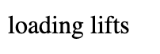
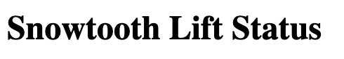
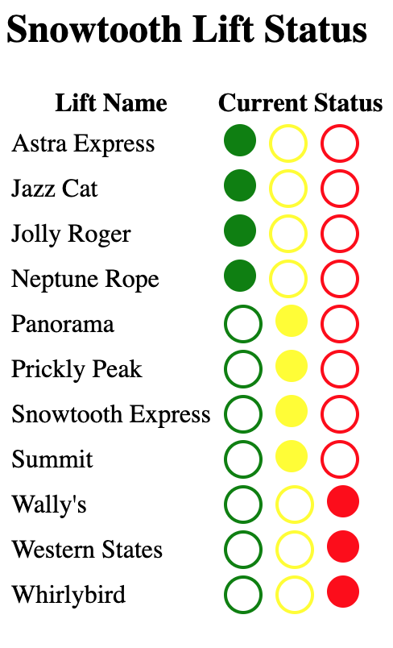

_by Alex Banks_

We spent years in Chicago performing late night, low-class improv comedy to audiences who were completely wasted. It's a commonly known improv fact that being a pirate in a scene is a hacky thing to do, but we know our way around pirates. If you were to ask me, what do pirates have to do with React? I would reply, Captain Hook obviously. A point that we spent a lot of time driving home at Reactathon.

What do pirates have to do with web development? Well, just like pirates choose to use hooks over hands, more and more web developers are choosing to use hooks over classes. They provide a clean way incorporate reusable functionality into components. Recently, Apollo launched a library of hooks that interact with the Apollo Client. Using `@apollo/react-hooks` is like putting a pirate on a rocket-ship to the moon. Yea, it's badass. Let's take a look.

In this example, we are going to look at what it takes to build a chairlift status page for a fake ski resort, Snowtooth Mountain. Skiers use chairlifts to get up the hill. Chairlifts are like flights. Sometimes chairlifts are placed on hold due to inclement weather conditions, and other times they are closed. Typically, the ski patrol is responsible for opening and closing chairlifts. We need to build a tool that the fake ski patrol can use to open and close fake lifts so that this fake status can instantly be communicated to the fake skiers.

Snowtooth already has a [lift and trail status api](https://snowtooth.moonhighway.com). If you follow along, we'll all be using the same API which could get chaotic because anyone connected to this API can change a lift status at anytime. If you want to work in your own sandbox you can [clone the lift and trail status repository](https://github.com/MoonHighway/snowtooth) and run this GraphQL API locally.

In order to get current data about all of the lifts, we will be running this query:

```graphql
query {
  allLifts {
    id
    name
    status
  }
}
```

This will return the `id`, `name`, and current `status` of each chairlift. To change the status we will be running this mutation:

```graphql
mutation SetLiftStatus($id: ID!, $status: LiftStatus!) {
  setLiftStatus(id: $id, status: $status) {
    id
    status
  }
}
```

This mutation requires a lift `id` and `status` which can be either `OPEN`, `CLOSED`, or `HOLD`. Finally we will be listening for status changes using this subscription:

```graphql
subscription {
  liftStatusChange {
    id
    status
  }
}
```

Whenever anyone changes the stats of any lift, that lift's `id` and new `status` will be pushed to the client. You can test all of these out in the [lift and trail status api](https://snowtooth.moonhighway.com).

## Creating a React App

To get started we will need to create a new React application. We can use `create-react-app` to provide the initial application. Run the following command in your terminal:

```
npx create-react-app snowtooth-ui
cd snowtooth-ui
```

This will generate the initial React application and move you to that folder where you will be working. With React application in place, it is now time to setup Apollo CLient. First, we'll need to install the necessary tools to build the client:

```
npm i apollo-link-http apollo-cache-inmemory apollo-client
```

This installs the http link that we will use for network communication, the cache that the client will use to cache data in local memory, and Apollo Client itself.

Now we'll need some tools to use the client with React:

```
npm i @apollo/react-hooks graphql-tag
```

This installs `@apollo/react-hooks`, the Hooks library that is the subject of this article along with the `graphql-tag` function that we will be using when we define our operations.

Finally, we need `styled-components` to help us build status indicators:

```
npm i styled-components
```

## Setting up Apollo Client

First, we need to set up an instance of the Apollo Client and add it to React Context using a Provider. In the `./src/index.js` file, add the following code:

```javascript
import React from 'react';
import { render } from 'react-dom';
import { ApolloClient } from 'apollo-client';
import { InMemoryCache } from 'apollo-cache-inmemory';
import { createHttpLink } from 'apollo-link-http';
import { ApolloProvider } from '@apollo/react-hooks';
import App from './App';

// 1. Create Apollo Client instance
const link = createHttpLink({ uri: 'http://snowtooth.moonhighway.com' });
const cache = new InMemoryCache();
const client = new ApolloClient({ link, cache });

// 2. Place client in context
render(
  <ApolloProvider client={client}>
    <App />
  </ApolloProvider>,
  document.getElementById('root')
);
```

Then, we'll create a new instance of the Apollo Client using a http link to manage the network requests along with an instance of the `InMemoryCache` for caching the data. The http link will point to `http://snowtooth.moonhighway.com`, the lift status api. Next, we add the `client` instance to React context using the `ApolloProvider`. This means that any children of the App component will have access to the client via context.

## The useQuery Hook

We are now ready to incorporate our first hook, the `useQuery` hook. We will use this hook in the main `<App />` component where we will display the lifts along with their current status. Open, or create and open, the `./src/App.js` file and add the following code:

```javascript
import React from 'react';
import styled from 'styled-components';
import gql from 'graphql-tag';
import { useQuery } from '@apollo/react-hooks';

const QUERY = gql`
  query {
    allLifts {
      id
      name
      status
    }
  }
`;
```

Then we import `React`, `useQuery`, and `gql` (a function that will turn our query into an AST). We also import `styled-components`. We also declared a `QUERY` using the `allLifts` query that we introduced above. Let's use this query with the `useQuery` hook:

```javascript
export default function App() {
  const { loading, data } = useQuery(QUERY);

  if (loading) return <p>loading lifts</p>;

  return <h1>Snowtooth Lift Status</h1>;
}
```

The `App` component obtains the `loading` state and `data` from Apollo via the `useQuery` hook. Although the first line of code inside this function may look like a standard variable declaration, it's not. It's a hook. This means that whenever the state of our `allLifts` query changes in Apollo Client, the `App` function will be reinvoked. This is presently happening. You can view it by starting the development server:

```
npm start
```

After you start the development server, you will see that the `<App />` component renders twice. It happens pretty fast, you may need to throttle your browser to see it. In Google Chrome, you can throttle network request speed by opening the **developer tools** and accessing the **network** panel. There is a drop down list on this panel that can be used to throttle requests. Choosing **Fast 3G** or **Show 3G** from the drop down will slow the network down enough to initially see the loading message:



The first time the `App` component is rendered, the value for `loading` is `true`. This is because Apollo Client is currently sending the query. It's loading our data. Once we have a response, the `useQuery` hook will invoke the `App` function again. This time the `loading` state is false, our `data` has loaded and we see the page heading:



You could obtain any errors by destructuring the `error` field in the response. For brevity and simplicity, we will not be handling errors in this iteration.

It's time to render the data in a real user interface. Replace the current `return` statement with the following code:

```javascript
return (
  <section>
    <h1>Snowtooth Lift Status</h1>
    <table>
      <thead>
        <tr>
          <th>Lift Name</th>
          <th>Current Status</th>
        </tr>
      </thead>
      <tbody>
        {data.allLifts.map(lift => (
          <tr key={lift.id}>
            <td>{lift.name}</td>
            <td>{lift.status}</td>
          </tr>
        ))}
      </tbody>
    </table>
  </section>
);
```

This table displays the name and status of each lift. That information is available in `data.allLifts`. A table row `<tr>` is created for each lift. Nested within the row, a table cell `<td>` is created for the lift's name and status.

It's time to use `styled-components`. Let's a visual indicator to display the current status:

```javascript
const StatusIndicator = ({ status = 'CLOSED', onChange = f => f }) => (
  <>
    <Circle
      color="green"
      selected={status === 'OPEN'}
      onClick={() => onChange('OPEN')}
    />
    <Circle
      color="yellow"
      selected={status === 'HOLD'}
      onClick={() => onChange('HOLD')}
    />
    <Circle
      color="red"
      selected={status === 'CLOSED'}
      onClick={() => onChange('CLOSED')}
    />
  </>
);

const Circle = styled.div`
  border-radius: 50%;
  background-color: ${({ color, selected }) =>
    selected ? color : 'transparent'};
  border: solid 2px ${({ color }) => color};
  border-width: ${({ selected }) => (selected ? '0' : '2')};
  width: 20px;
  height: 20px;
  float: left;
  cursor: pointer;
  margin: 0 4px;
`;
```

The second component, the `Circle`, displays an individual status circle. When the `Circle` is selected, the background color of that circle will be filled in. The first component, `StatusIndicator`, renders three circles: a green circle for the `OPEN` status, a yellow circle for the `HOLD` status, and a red circle for `CLOSED`. This component is also clickable. When a circle is clicked, It will send the current status to the `onChange` function. We'll use this event later when implementing the mutation. Right now, let's simply display the status with the `StatusIndicator`:

```javascript
{
  data.allLifts.map(lift => (
    <tr key={lift.id}>
      <td>{lift.name}</td>
      <td>
        <StatusIndicator status={lift.status} />
      </td>
    </tr>
  ));
}
```

Now a visual indicator visually displays each lifts status.



## The useMutation Hook

With the clickable `StatusIndicator` in place, we are ready to incorporate the `useMutation` hook. Go ahead and import this hook to the current file:

```javascript
import { useQuery, useMutation } from '@apollo/react-hooks';
```

And add the `SetLiftStatus` mutation to the file right below the `QUERY`:

```javascript
const MUTATION = gql`
  mutation SetLiftStatus($id: ID!, $status: LiftStatus!) {
    setLiftStatus(id: $id, status: $status) {
      id
      status
    }
  }
`;
```

Just like we used the `QUERY` earlier, we can use this `MUTATION` in a hook. Locate the `useQuery` hook within the `App` function and add a `useMutation` hook right below it:

```javascript
const { loading, data } = useQuery(ALL_LIFTS_QUERY);
const [setLiftStatus] = useMutation(MUTATION);
```

This hook returns an array. The first value in that array is a function that we can use to trigger the mutation. Here we destructure this value into a variable called `setLiftStatus`. The second value of this array is an object that will give you the `loading` and `error` state of the mutation, but we are currently not using those fields.

We can now add the `onChange` function to the `StatusIndicator`:

```javascript
<StatusIndicator
  status={lift.status}
  onChange={status => {
    const variables = { id: lift.id, status };
    setLiftStatus({ variables });
  }}
/>
```

When the user selects a status by clicking one of the status circles, the `onChange` function will be invoked and the status: `OPEN`, `HOLD`, or `CLOSED` will be passed to the handler. Within the handler we will create an object called `variables`. This is where we will pass the values for the current lift's `id` and it's new `status` to the mutation. Invoking `setLiftStatus` will cause the `client` to send the mutation to our API. Remember, `useMutation` is a hook. It will cause the `App` component to re-render when the mutation state changes. In this example, every time we change the status of a chairlift, the `App` function will be invoked twice: once when the client sends the mutation, and again when the client receives a mutation response.

When the mutation receives a response, something magical happens. The Apollo Client knows that we asked the mutation to return the `id` and new `status` of a specific lift. The client will use the `id` to locate the `Lift` within the local cache and update its `status`. Changing this value in the cache causes the `App` function to be invoked again. That's right one click causes this component to be rendered 3 times. The first render is when the mutation is being sent, the second render is when the mutation receives a response, and the third render comes from the `useQuery` hook. It invokes the `App` function again because the cache has changed and new `data` is available. This is awesome because the new data will automatically be rendered and we will see the status indicator indicate a new status.

## The useSubscription Hook

At this point, we can use our app to change the status of individual lifts. However, if we open another browser tab, we will not see the lift status change reflected in the new tab. Additionally, if any other user changes the status of any lift, we will not see that change until we refresh the page.


We can fix this by adding a subscription to listen for status changes on Lift types. Before we get started, we need to configure the Apollo Client to handle subscriptions. We'll need to install the following npms:

```
npm i apollo-link-ws subscriptions-transport-ws
```

This installs the `apollo-link-ws`, a link that we can use to handle networking requests over WebSockets. Subscriptions use WebSockets. The `apollo-link-ws` requires the `subscriptions-transport-ws` package. This package contains the client socket code that is necessary to make subscriptions work.

We'll need to use these packages in our client configuration, add them to `index.js`:

```javascript
import { WebSocketLink } from 'apollo-link-ws';
import { split } from 'apollo-link';
import { getMainDefinition } from 'apollo-utilities';
```

Now replace the `link` that we use to create `client` instance. We'll actually need to create two links: one for http requests, and another for websockets. We'll also need to use a function to decide when to use which link.

```javascript
const httpLink = createHttpLink({
  uri: 'http://snowtooth.moonhighway.com'
});
const wsLink = new WebSocketLink({
  uri: `ws://snowtooth.moonhighway.com/graphql`,
  options: {
    reconnect: true,
    lazy: true
  }
});
const link = split(
  ({ query }) => {
    const { kind, operation } = getMainDefinition(query);
    return kind === 'OperationDefinition' && operation === 'subscription';
  },
  wsLink,
  httpLink
);
```

Here we renamed the `link` to `httpLink`. This link will work as it did before. It will send queries and mutations to [http://snowtooth.moonhighway.com](http://snowtooth.moonhighway.com). Below that we created a second link, the `wsLink`. This link is used to connect to the websocket at `ws://snowtooth.moonhighway.com/graphql`. In the `options` we tell this link to attempt to automatically reconnect when the connection is dropped. We have also set the `lazy` option to `true` which prevents our link from connecting to the web socket until the client has been asked to subscribe. No need to connect to a socket when there is not a subscription.

The Apollo Client can only use one `link` at a time, so we use the `split` function to split between the `httpLink` and the `wsLink`. The first argument sent to this function is a _predicate_. A _predicate_ is a function that only returns `true` or `false`. In this case, it is a function that checks the current operation to see if it is a subscription operation. If this function returns true, the next argument, the `wsLink`, will be used. If the predicate returns `false`, as it will when the operation is a query or a mutation, the value of the third argument sent to the `split` function will be used. This is the `httpLink`. With our new link in place the Apollo Client is ready to handle the `useSubscription` hook.

Next, we will need to import the `useSubscription` hook:

```javascript
import { useQuery, useMutation, useSubscription } from '@apollo/react-hooks';
```

Now, we will need to add the GraphQL subscription to the page right below the `QUERY` and the `MUTATION`:

```javascript
const SUBSCRIPTION = gql`
  subscription {
    liftStatusChange {
      id
      status
    }
  }
`;
```

Just like before, we can use this `SUBSCRIPTION` in a hook. Add the `useSubscription` hook right below the `useMutation` hooK:

```javascript
const { loading, data } = useQuery(QUERY);
const [setLiftStatus] = useMutation(MUTATION);
useSubscription(SUBSCRIPTION);
```

That's it. The subscription should be working. Wait, that's it? It's voodoo for sure, but adding this hook tells Apollo Client to listen for a subscription. When a subscription is received, the hook will cause the `App` function to re-render. Then Apollo Client will use the `id` returned by the subscription to locate the `Lift` object in the cache and update the value of it's new `status`. Changing the data in the cache causes the `useQuery` hook to invoke the `App` function again with the new data from the cache. This time the data change will be reflected in the UI, and you will see all of the connected clients update their UI as well... that's it.


Now we have an app that the ski patrol can use to change lift status in real time. The data is provided by the `useQuery` hook, changed with the `useMutation` hook, and synchronized with the `useSubscription` hook. You now know what it feels like to be a pirate on a rocketship to the moon!

The project is running here on CodeSandbox:

<iframe
  src="https://codesandbox.io/embed/green-lake-zgb1d?fontsize=14"
  title="green-lake-zgb1d"
  style="width:100%; height:500px; border:0; border-radius: 4px; overflow:hidden;"
  sandbox="allow-modals allow-forms allow-popups allow-scripts allow-same-origin"
/>
