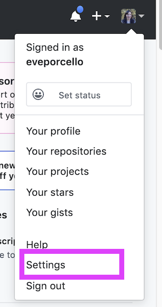
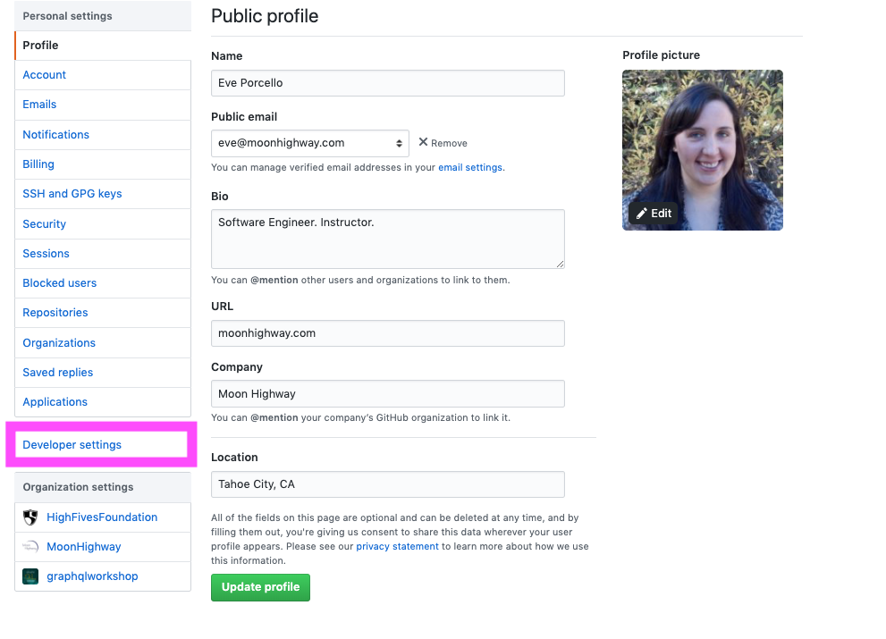
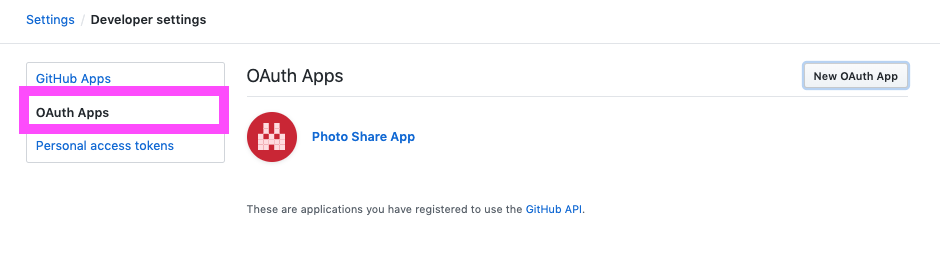
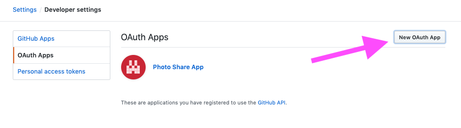
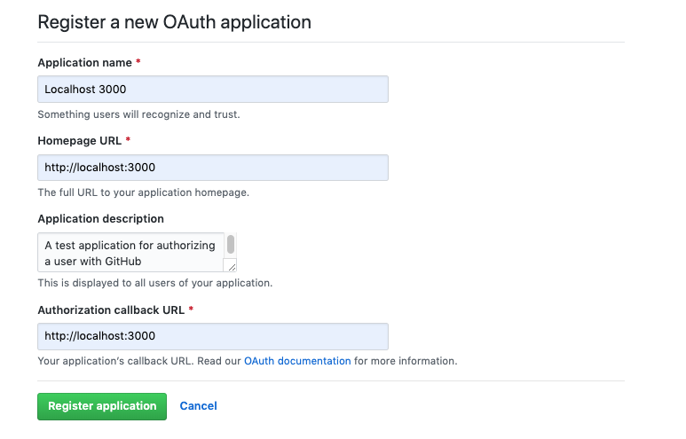

Authorizing and authenticating users is an important part of building web applications. We need to know who the users are and what they are allowed to see. With a GraphQL app, how do we make sure that a user is allowed to see content? We need to authenticate them to make sure that we identify them. We also need to authorize them to prove that they have the right to access the application.

There are a number of strategies that can be used to authenticate and authorize users. In this article, we'll take a closer look at how to handle authorization with GitHub. We'll lean on GitHub to provide the account details, and we'll be able to use GitHub credentials for each user who attempts to log in.

## Setting Up GitHub OAuth

The first step of setting up GitHub authorization is to set up a GitHub app. The steps to do this are as follows:

1. Go to https://www.github.com and log in.
2. Go to Settings.
   
3. Go to Developer Settings.
   
4. Select OAuth Apps from the left navigation.
   
5. Select New Oauth App.
   
6. Add These Settings:
   - **Application name**: Localhost 3000
   - **Homepage URL**: http://localhost:3000
   - **Application description**: A test application for authorizing a user with GitHub
   - **Authorization callback url**: http://localhost:3000
     
7. Click Register Application.
8. Copy the Client ID and Client Secret from the account page.

Your GitHub app is all set up! Now you'll copy and paste the Client ID and Client Secret into a new file at the root of your project called `.env`. It should look like this with your own variables provided:

```
CLIENT_ID=<Your_Client_ID_Here>
CLIENT_SECRET=<Your_Client_Secret_Here>
```

## The Authorization Process

Now that our app is set up with GitHub, it's time to incorporate the authorization and authentication process into our GraphQL application. We'll send a request to GitHub via a URL that contains the GitHub Client ID to ask the user to allow access to their GitHub account. Then we'll take the response code and pass it back to GitHub to obtain a token. The token basically says "Ok, this user is allowed to use the app." They are authenticated, and they are authorized.

We will build and test all of these steps, but the basic process boils down to the following:

1. Client: Asks GitHub for a code using a url with a `client_id`.
2. User: Allows access to account info on GitHub for client application
3. GitHub: Sends code to OAuth redirect url: `http://localhost:3000?code=XYZ`
4. Client: Sends GraphQL Mutation `authorizeWithGithub(code)` with code
5. API: Requests a GitHub `access_token` with credentials: `client_id`, `client_secret`, and `client_code`
6. GitHub: Responds with `access_token` that can be used with future info requests
7. API: Request user info with `access_token`
8. GitHub: Responds with user info: `name, githubLogin, avatar`

To set this up on the server, we'll need to create two queries and one mutation:

1. A query to get the GitHub login url (which will give us the code): `githubLoginUrl`.
2. A mutation to authorize the user with GitHub: `authorizeWithGithub`
3. A query to return the currently logged in user: `me`.

### Step One: Create the `githubLoginUrl` Query

To authorize a user, I need to send my `CLIENT_ID` to GitHub. Once they recognize the Client ID, they'll let me authorize the app using my GitHub username and password. The URL I need to paste into my browser looks like this:

```
https://github.com/login/oauth/authorize?client_id=${Client-ID-here}&scope=user
```

Wouldn't it be cool if instead of typing this from memory I could send a query that returns that URL? So I can just copy and paste it into the browser? Yes, that would be extremely cool, so let's set that up in our schema. When I send the `githubLoginUrl` query, it should return the URL string:

```graphql
type Query {
  githubLoginUrl: String!
}
```

Now we need to write the resolver that will construct that URL for us. We have the structure for the link (`https://github.com/login/oauth/authorize?client_id=${Client-ID-here}&scope=user`), so all we need to do is provide the `CLIENT_ID` from the environment variables using a template string:

```javascript
Query: {
  githubLoginUrl: () =>
    `https://github.com/login/oauth/authorize?client_id=${
      process.env.CLIENT_ID
    }&scope=user`;
}
```

When I send the `githubLoginUrl` query, I receive back a string that can be easily pasted into the browser. The query will look like this:

```graphql
query {
  githubLoginUrl
}
```

And will return:

```json
{
  "data": {
    "githubLoginUrl": "https://github.com/login/oauth/authorize?client_id=YOUR-UNIQUE-CLIENT-ID&scope=user"
  }
}
```

When I visit this URL, the GitHub app in the browser will ask me to allow this app to have access to my GitHub account details. Next, I'll authorize the app and enter my password. Once I authorize the app, a new URL will be present in the URL bar. Then I will grab the code from the end of the URL string:

```
http://localhost:3000/?code=<YOUR-UNIQUE-CODE>
```

We'll hang on to this code for now because we'll need to send this back to GitHub to request a token. This process is pretty manual, but later when we build a client application, we'll handle all of this via UI elements. In other words, when I click a login button, all of this will happen behind the scenes. For now, this is a great way to test that the auth process is working.

### Step Two: Build the `authorizeWithGithub` Mutation

Now that we have the code, we need to pass that back to GitHub to obtain a token and the user's information. First, we'll add the `AuthPayload` type. This will return the token and all user details. This is the type that will be returned from the `authorizeWithGithub` mutation. Let's add both to the schema:

```graphql
type AuthPayload {
  githubToken: String!
  user: User!
}

type Mutation {
  ...
  authorizeWithGithub(code: String!): AuthPayload!
}
```

The `AuthPayload` type is used only as a response to authorization mutations. It contains the user who was authorized by the mutation along with a token that they can use to identify themselves during future requests.

Before we program the `authorizeWithGithub` resolver, we'll need to build two functions to handle GitHub API requests: one to ask for the token and then other to ask for the account info. `requestGithubToken` will ask for the token:

```javascript
const requestGithubToken = credentials =>
  fetch("https://github.com/login/oauth/access_token", {
    method: "POST",
    headers: {
      "Content-Type": "application/json",
      Accept: "application/json"
    },
    body: JSON.stringify(credentials)
  })
    .then(res => res.json())
    .catch(error => {
      throw new Error(JSON.stringify(error));
    });
```

The `requestGithubToken` function returns a fetch promise. The `credentials` are sent to a GitHub API URL in the body of a POST request. The `credentials` consist of the `client_id`, `client_secret`, and `code`. Once completed, the GitHub response is then parsed as JSON. We can now use this function to request a GitHub access token with `credentials`.

Once we have a GitHub token, we will need to access information from the current user's account. Specifically, we'll want their GitHub login, name, and profile picture. To obtain this information, we will need to send another request to the GitHub API along with the access `token` that we obtained from the previous request.

```javascript
const requestGithubUserAccount = token =>
  fetch(`https://api.github.com/user?access_token=${token}`).then(
    res => res.json
  );
```

This function also returns a fetch promise. On this GitHub API route, we can access information about the current user so long as we have an access token.

Now let's combine both of these requests into a single asynchronous function that we can use to authorize and return a user from GitHub, `requestGithubUser`:

```javascript
const requestGithubUser = async credentials => {
  const { access_token } = await requestGithubToken(credentials);
  const githubUser = await requestGithubUserAccount(access_token);
  return { ...githubUser, access_token };
};
```

Using async/await here makes it easier to handle multiple asynchronous requests. First, we request the access token and wait for the response. Then, using the `access_token`, we request the GitHub user account info and wait for a response. Once we have the data, we'll put it all together in a single object.

We have the user details. Now we need to store this somewhere. In a production app, this would be stored in the database and added to our GraphQL server's context so that all of the resolvers would have access to that data. Think of context as being like a store where you can put data, authentication details, or anything else a resolver function needs to know about. In this case, we're going to keep this brief, and add everything to a variable called `currentUser` that we'll create at the top of this file.

```javascript
let currentUser;
```

Then we can overwrite that with the user details in the `authorizeWithGithub` function.

We've created the helper functions that will support the functionality of the resolver. Now, let's actually write the resolver to obtain a token and a user account from GitHub:

```javascript
async authorizeWithGithub(parent, { code }) {
  // 1. Obtain data from GitHub
    let githubUser = await requestGithubUser({
      client_id: <YOUR_CLIENT_ID_HERE>,
      client_secret: <YOUR_CLIENT_SECRET_HERE>,
      code
    })
  // 2. Package the results in a single object, write the value to currentUser global variable
    currentUser = {
      name: githubUser.name,
      githubLogin: githubUser.login,
      githubToken: githubUser.access_token,
      avatar: githubUser.avatar_url
    }
  // 3. Return user data and their token
    return { user: currentUser, token: access_token }
  }
```

Resolvers can be asynchronous. We can wait for a network response before returning the result of an operation to a client. The `authorizeWithGithub` resolver is asynchronous because we have to wait for two responses from GitHub before we'll have the data that we need to return.

It's time to test this authorization process, and to test, you need a code. To obtain the code, you'll need to run the `githubLoginUrl` query.

Paste the url into the location bar of a new browser window. You will be directed to GitHub where you will agree to authorize this app. When you authorize the app, GitHub will redirect you back to `http://localhost:3000` with a code:

`http://locahost:3000?code=XYZ`

Here, the code is **XYZ**. Copy the code from the browser URL and send it to the `authorizeWithGithub` mutation:

```graphql
mutation {
  authorizeWithGithub(code: "XYZ") {
    token
    user {
      githubLogin
      name
      avatar
    }
  }
}
```

This mutation will authorize the current user and return a token along with information about that user. Save the token. We'll need to send it in the header with future requests.

**Note**: When you see the error "Bad Credentials", it means that the client id, client secret, or code that was sent to the GitHub API is incorrect. Check the client id and client secret, but often it's the code that causes this error. GitHub codes are only good for a limited time period, and they can only be used once. If there is a bug in the resolver after the credentials were requested, the code used in the request will no longer be valid. Typically, you can resolve this error by requesting another code from GitHub.

### Authenticating Users

In order to identify yourself in future requests, you will need to send your token with every request in the `Authorization` header. That token will be used to identify the user by looking up their database record.

GraphQL Playground has a location where you can add headers to each request. In the bottom corner, there is a tab right next to "Query Variables" called "HTTP Headers". You can add HTTP Headers to your request using this tab. Just send the headers as JSON:

```json
{
  "Authorization": "Bearer <YOUR_TOKEN>"
}
```

Replace `<YOUR_TOKEN>` with the token that was returned from the `authorizeWithGithub` mutation. Now you are sending the key to your identification with each GraphQL request.

### Step 3: Create a `me` Query

To bring this auth process full circle, we need to create one more query. Consider a user interface for any app where you have to log in. Once you provide valid credentials, there's typically a new element on the screen to reflect that logged in state. In other words, if I log in to Twitter, I will see my face in the upper right hand corner. Let's create a query that will return the currently logged in user's details.

First, we will need to modify our `typeDefs`:

```graphql
type Query {
  me: User
  ...
}
```

The `me` query returns a nullable user. It will be null if a current authorized user is not found. Let's add the resolver for the me query:

```javascript
const resolvers = {
  Query: {
    me: () => currentUser,
    ...
  }
}
```

We've already done the heavy lifting of looking up the user based on their token. At this point, you'll simply return the `currentUser` object. Again, this will be null if there is not a user.

If the correct token has been added to the HTTP Authorization header, you can send a request to obtain details about yourself using the `me` query:

```graphql
query currentUser {
  me {
    githubLogin
    name
    avatar
  }
}
```

When you run this query, you will be identified. A good test is to try to run this query without the authorization header or with an incorrect token. Given a wrong token or missing header, you'll see that the `me` query is null.

There is no "one true way" to handle user authentication and authorization with GraphQL, but using a social OAuth solution like GitHub can be a quick way to get started. The process of passing tokens might differ slightly for Facebook, Google, or Auth0, but the main ideas will be consistent. We can use mutations to authenticate and authorize users and then with the data saved about a valid user, we can write queries for that user data.

In the next part of this series, we will look at how to set up authorization with GraphQL clients, specifically Apollo Client.