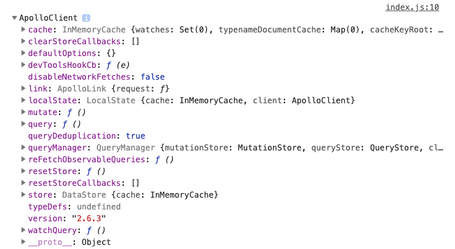
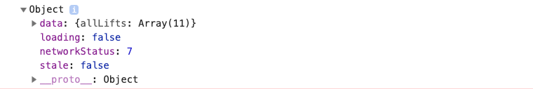
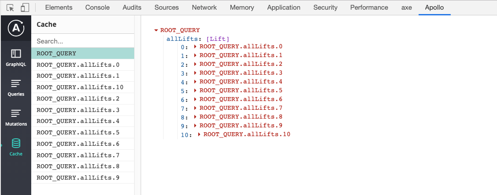

A few months ago, we posted an article about how to [fetch data from a GraphQL API](https://moonhighway.com/fetching-data-from-a-graphql-api). In it, we looked at the [Snowtooth API](https://snowtooth.moonhighway.com), a fake ski resort with a real GraphQL API, and we were able to send queries to get data and send mutations to change data. We all had a great time.

Now that a few months have passed, our hair is a little longer. Our beard a bit more full. And now we might be thinking: is it time to incorporate Apollo Client? Or more importantly, why might you want to incorporate Apollo Client?

Apollo Client handles network requests and efficient caching. It will handle the network interface with the GraphQL API by creating a link. The cache will save queries and their resulting objects. A huge benefit of using REST is the ease with which you can handle caching. With REST, you can save the response data from a request in a cache under the URL that was used to access that request. For example, if Snowtooth was a REST API, you'd go to the lifts route, `/lifts`, to get lift data, and then you'd cache the data at under that URL.

With GraphQL, we're dealing with a single endpoint, so having a localized caching solution is essential as we build fast, efficient apps. We could create our own cache, but leaning on the vetted Apollo Client is a great place to get started.

## Apollo Client Setup

Let's create a simple Apollo Client that will get data from the Snowtooth API.

Then, we'll set up the project using Create React App. Using React isn't required for working with Apollo Client, but running this will generate a project shell for us that might be useful when extending this into a real application.

Start by running this command in the Terminal or Command Prompt:

```
npx create-react-app snowtooth-client
```

`npx` will execute the `create-react-app` command with the name of the project, in this case, `snowtooth-client`. Then make sure you're in the `snowtooth-client` directory and start the app:

```
cd snowtooth-client
npm start
```

This will run the starter app on `localhost:3000`. Next, we'll install some dependencies:

```
npm i apollo-client graphql
```

All of the changes we'll make to our mini app will happen in the `src/index.js` file. The first change is that we'll highlight everything in the file and delete it. Then we'll create the client and log whatever the client is to the console:

```javascript
import { ApolloClient } from "apollo-client";

const client = new ApolloClient();

console.log(client);
```

At this point, we should be seeing an error: `Uncaught TypeError: Cannot read property 'cache' of undefined`. Remember earlier that we said that Apollo Client gives us two things: the link to the GraphQL data and the cache? Well, those are the two things that need to be provided to the client constructor when setting it up. Start by installing a few more helpful packages:

```
npm i apollo-link-http apollo-cache-inmemory
```

These packages are going to help us connect to our GraphQL API and set up a local cache. Once installed, we'll import and use them in the `index.js` file. Let's start with the imports:

```javascript
import { createHttpLink } from "apollo-link-http";
import { InMemoryCache } from "apollo-cache-inmemory";
```

Then we'll use these helpers in the client constructor:

```javascript
const client = new ApolloClient({
  link: createHttpLink({ uri: "https://snowtooth.moonhighway.com" }),
  cache: new InMemoryCache()
});
```

`createHttpLink` takes in an object with our GraphQL API provided on the `uri` key and will fetch GraphQL results from a GraphQL API over an http connection. `InMemoryCache` is the default cache implementation for Apollo Client 2.0.

We can check out `localhost:3000` again and open the console. This is now logging the client. There's not too much here yet, but we can see some familiar values here like the `cache` and `link`.



At this point, we're not sending a request though. In order to send a request (a query) to the GraphQL endpoint, we'll need to incorporate one last package: `graphql-tag`.

```
npm install graphql-tag
```

Once installed, we'll import a function called `gql` from `graphql-tag` and wrap the query that we want to send to the API in this tag:

```javascript
import gql from "graphql-tag";

const query = gql`
  query {
    allLifts {
      name
    }
  }
`;
```

The tag function `gql` that wraps the query will parse the query string and turn it into an AST, an abstract syntax tree. An AST is a representation of the query string as an object. Once defined, we'll use the `client.query` function to send a query to the GraphQL API:

```javascript
client
  .query({
    query
  })
  .then(console.log);
```

Calling `client.query` will send the query to the API that is defined in our client instantiation. Once you run this, you should see the JSON response logged to the console:



This object gives us all of the data from the query on the key called `data`. We also see whether the data is loading, if the request is stale, and the network status code. If successful, the network status code will be 7.

Another thing we can take a look at with a console log message is the cache:

```javascript
console.log("Cache", client.cache);
```

This will show the entire client cache object. We can drill down into the data response as well with:

```javascript
console.log("Cache", client.extract());
```

The data is cached on a key called `ROOT_QUERY`. Then we see the data added to an index on the query value. For example, if we ask for `allLifts`, the first lift will be cached at `allLifts.0`, the second lift cached at `allLifts.1`, and so on.

If you want to be able to view the state of the cache in a nicer user interface, I'd recommend installing the [Apollo Dev Tools Chrome Extension](https://chrome.google.com/webstore/detail/apollo-client-developer-t/jdkknkkbebbapilgoeccciglkfbmbnfm?hl=en-US). Any time you're on a page that is using Apollo Client, you'll be able to open the Dev Tools This will give you visibility into the cache which is a little nicer than logging these details to the console:



The fact that you can see the state of the cache is cool, but it's also really useful to have the GraphiQL explorer available. If the page you're viewing has an instance of the Apollo Client, you'll be able to use GraphiQL to introspect the schema and send queries, mutations, and subscriptions. Killer.

Apollo Client doesn't require you to use any sort of specific UI library. Everything we've done in this article has used good old vanilla JavaScript. If you want to learn more about how to integrate Apollo Client with React though, check out our other article on [Apollo React Hooks](https://moonhighway.com/apollo-hooks)!

Check out the project running on CodeSandbox:

<iframe src="https://codesandbox.io/embed/adoring-dewdney-kp3e8?fontsize=14" title="apollo-client-quick-setup" allow="geolocation; microphone; camera; midi; vr; accelerometer; gyroscope; payment; ambient-light-sensor; encrypted-media" style="width:100%; height:500px; border:0; border-radius: 4px; overflow:hidden;" sandbox="allow-modals allow-forms allow-popups allow-scripts allow-same-origin"></iframe>
