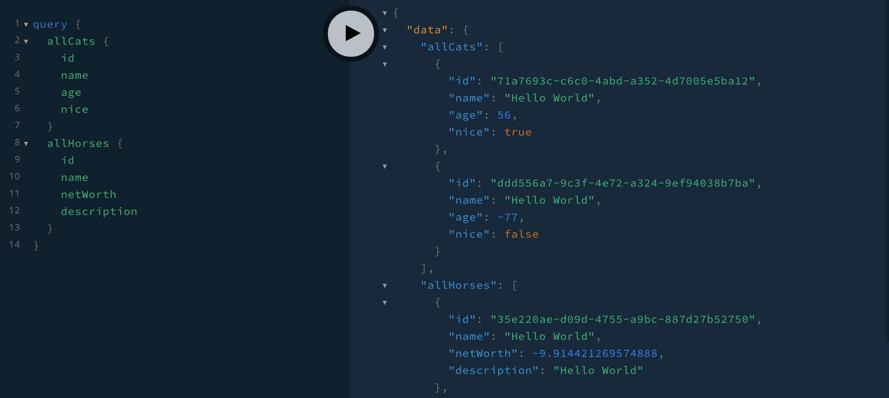
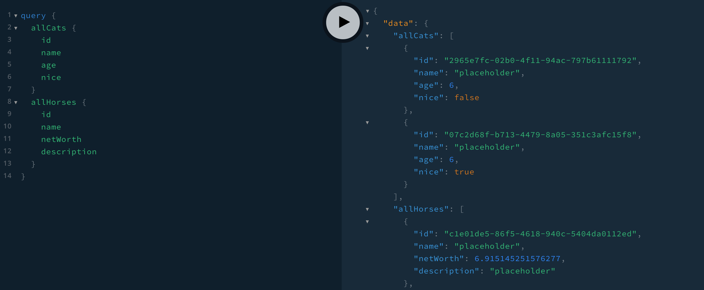

One of the most powerful features of GraphQL is its schema definition language. When we write a schema, we define all of the types that are available on our API. If our GraphQL server provides us with an enforced list of type definitions, that means that GraphQL gives us an added benefit: mocking.

Mocking gives us a way to supply fake data for fields that are part of our schema. If a field should return a `String` type, a mock will return a fake string for that field.

Consider that we're building a website that sells shoes. We'd start by defining the `Item` type in the schema:

```graphql
type Item {
  id: ID!
  name: String!
  color: Color!
  sizes: [Size!]!
  price: Float!
  reviews: [Review!]!
}
```

In a perfect world, we would have access to the data (a database, a REST service, etc.) that backs this type, and we could test on the server to make sure that we're able to return the data for an item. But it's not always that easy. The data might be unavailable because it's managed by another team or maybe the service isn't even set up yet. We don't need to let that stop our development flow if we're working with GraphQL. The schema allows us to get prototyping right away with mock data.

One of the ways that you can mock data for a GraphQL server is to use the [mocking utilities that are part of Apollo Server](https://www.apollographql.com/docs/apollo-server/testing/mocking/). Let's go through the process of setting up a minimal server that incorporates mocks.

## Apollo Server Setup

We'll start by setting up a minimal server:

```
npm init -y
npm install apollo-server graphql
```

Then we'll create an `index.js` file to initalize the server. Typically when creating a server, we'd send `typeDefs`, the schema, and `resolvers`, the functions that return data for the fields in the schema to the `ApolloServer` constructor. But let's assume we don't have any data yet. In that case, we'll create the server with the `typeDefs` and `mocks: true`:

```javascript
const { ApolloServer, gql } = require('apollo-server');

const typeDefs = gql`
  type Query {
    message: String!
  }
`;

const server = new ApolloServer({
  typeDefs,
  mocks: true
});

server.listen().then(({ url }) => console.log(`Server running on ${url}`));
```

Now if you run `node index`, you'll see the GraphQL Playground running on `localhost:4000`, and you can send a query for `message` that returns `Hello World`:

```graphql
query {
  message
}
```

## Creating a Schema

Next, let's add on to our schema to make it more robust.

```graphql
type Cat {
  id: ID!
  name: String!
  age: Int!
  nice: Boolean
}
type Horse {
  id: ID!
  name: String!
  netWorth: Float!
  description: String
}
type Query {
  allCats: [Cat!]!
  allHorses: [Horse!]!
}
```

If we run the server again, we'll see that every query that we send will return data for each field that is defined in the schema.



Each field returns a specific value according to its type:

- `ID` returns a unique ID (uuid)
- `String` returns `Hello World`
- `Int` returns a random integer (positive or negative)
- `Float` returns a random float (positive or negative)

Also, `allCats` and `allHorses` are queries that return lists. You'll notice that these queries return two objects. This is the default number of objects that can be returned for a field. Later, we'll learn how to customize the number of list items that are returned.

## Creating Custom Mocks

The default mocking behavior of Apollo Server is pretty powerful. With a single line of code `mocks: true`, we're able to get started with our GraphQL project without writing any resolvers. It's also possible to create custom mocks for individual types and fields.

### Mocking Scalar Types

When we create a custom mock, a good place to start is by mocking a scalar type. A custom mock will replace the default value that is supplied by Apollo Server. We'll start by adding a `mocks` object with a couple methods for `Int` and `String`:

```javascript
const mocks = {
  Int: () => 6,
  String: () => 'placeholder'
};
```

Then replace `mocks: true` with the `mocks` object:

```javascript
const server = new ApolloServer({
  typeDefs,
  mocks
});
```

Now if we try sending the query again, any `Int` will return `6`, and any `String` will return `placeholder`. Because we haven't defined overwriting mocks for other scalar types, the query will return Apollo Server's mocked defaults for those fields:



### Returning Mocked Lists

Every time we send a query that returns a list (`allCats`, `allHorses`), we see that two mocked objects are returned. It's possible to customize the number of results for a query that returns a list. We'll use the `MockList` from Apollo Server:

```javascript
const { ApolloServer, gql, MockList } = require('apollo-server');
```

Then adjust the `mocks` object to include the `MockList`. In this case, let's adjust to make `allCats` return 5 `Cat` objects:

```javascript
const mocks = {
  Query: () => ({
    allCats: () => new MockList(5)
  }),
  Int: () => 6,
  String: () => 'placeholder'
};
```

It's also possible to return a random number of objects between two numbers. Let's say we wanted every `allCats` query to return between `1` and `20` cats. Just pass an array into the `MockList`:

```javascript
const mocks = {
  Query: () => ({
    allCats: () => new MockList([1, 20])
  })
};
```

### Incorporating `faker`

There are many libraries that generate fake data for mocking purposes. It's fun to incorporate one of these libraries into your GraphQL schema mocking projects. We'll be using `faker`. Start by installing `faker` with npm:

```
npm install faker
```

Then we'll use this to create some more robust mocks. There are many different `faker` functions you can use to generate data for various types of fields. The [documentation](https://github.com/Marak/Faker.js#readme) describes all of them! Let's adjust the server to use some of these helpful functions. For example, we can generate a random number between 1 and 25 for an `Int`. Then we can generate a random `firstName` for a `String`:

```javascript
const mocks = {
  ...
  Int: () => faker.random.number({ min: 1, max: 25 }),
  String: () => faker.name.firstName()
};
```

You can even do tricky things like return a random item from an array using faker. Let's create a list of `horseDescriptions` that will be returned for the `description` field:

```javascript
const horseDescriptions = ['majestic', 'honorable', 'street smart'];

const mocks = {
  Horse: () => ({
    description: () => faker.random.arrayElement(horseDescriptions)
  })
};
```

The random array element function will take in the array of options and return one at random when queried.

### Mocking Part of the Schema

Another common situation that you might encounter when mocking is that you have access to some but not all data. It's possible to write resolver functions for certain fields and then mock the rest of the data. Let's consider the following resolver for `allHorses`:

```javascript
const resolvers = {
  Query: {
    allHorses: () => [
      {
        id: 1,
        name: 'Hank'
      }
    ]
  }
};
```

This is a small example, but you might make database calls or REST requests in a resolver like this to a current working service. Once created, you'll adjust the server constructor to include the resolvers and an important configuration option, `mockEntireSchema`:

```javascript
const server = new ApolloServer({
  typeDefs,
  resolvers,
  mocks,
  mockEntireSchema: false
});
```

If `mockEntireSchema` is set to `false`, fields that have resolvers will use the resolvers. Fields that don't have resolvers will use the mocks.

GraphQL is a type system for your API. These types that are provided by the schema allow us to mock data fields so that we can move quickly to create GraphQL prototypes even if we don't have access to all of the data.

Mocking is also possible on the client. Come back here next week to learn more!
