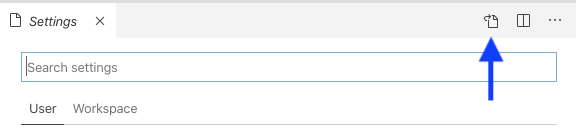

In a couple weeks, we're going to be celebrating Moon Highway's eighth anniversary. Eight years of classes, video recordings, talks, and webinars. There's been a whole lot of typing into a code editor in front of people, and one of our main goals when doing this is to make sure that people can read the screen.

It's something that we're always trying to get better at. When Alex and I sit in on each other's classes, we are each other's screen work watchdogs/worst nightmares. I remember teaching a class and having a text pop up on my iPad (which had my notes) that read simply and condescendingly: "SCREEN! WORK!". I also recall passing a note to Alex during a class that said "NO ONE CARES IF THEY CAN'T READ YOUR SCREEN".

All of this interpersonal and intermarital rudeness only happens because the stakes are high. A readable screen is everything. Over the years, our focus on screen work has yielded a few must-do's when presenting code. 

## Light or Dark Theme?

We love dark mode, right? Asking most developers to look at a light theme is like asking a vampire to look at the sky on a hot summer day. They'll be upset and tell you it's too bright. But dark mode isn't always the easiest to read depending on which room you're in.

At every class I have taught for the past 2 years, I've asked the students to do a quick vote for dark or light mode. Almost always, the students will pick light mode. That depends on the room and the projector though. Before you start teaching, you can test your environment by putting a code sample on the screen then sitting in the farthest away seat and seeing if you can read anything. If you can't read anything, do whatever it takes to make sure that you fix it.

## Zen Mode

This is a trick that I stole from [John Lindquist](https://twitter.com/johnlindquist), the co-founder of egghead.io. If you're using VSCode, there are a lot of helpful menu links, icons, and tooltips. When you're teaching, all of these are a distraction to your students. 

As John recommends, turn on Zen Mode before you hit record. To find this setting, find the `View` menu, select `Appearance`, then select `Zen Mode`. This might center your code with huge borders. Don't worry. We'll fix that in a second in the VSCode teacher settings.

## Create a List of VSCode Settings for Teaching

When you're writing code in VSCode, isn't it awesome how popups appear to give you parameter hints and code completion tips? When you're watching a tutorial, isn't that... not awesome? We put together a list of settings that help override the defaults when you need to teach. Get those pesky popups out of the way so students can follow along. 

To change your VSCode settings, select the `Code` menu option right next to `File`. Then select `Settings`. Now you want to find the little paper icon in the upper right corner.



Clicking that icon will take you to a file called `settings.json`. This contains all of your settings for VSCode. To get started, you can copy and paste your current settings somewhere for safe keeping and then use your Teacher Settings instead. You can also create VSCode teaching profiles as highlighted by [Andy VanSlaars in his Code Profiles GitHub repo](https://github.com/avanslaars/code-profiles).

The settings we use for teaching and recording are the following. Feel free to pick and choose what works for you from these:

```json
{
  "zenMode.hideLineNumbers": false,
  "workbench.colorTheme": "Visual Studio Light",
  "editor.quickSuggestions": {
    "other": false,
    "comments": false,
    "strings": false
  },
  "editor.wordBasedSuggestions": false,
  "editor.suggestOnTriggerCharacters": false,
  "[javascript]": {
    "editor.formatOnSave": true
  },
  "workbench.statusBar.visible": false,
  "editor.renderLineHighlight": "none",
  "javascript.updateImportsOnFileMove.enabled": "always",
  "workbench.startupEditor": "welcomePage",
  "editor.minimap.enabled": false,
  "git.enableSmartCommit": false,
  "window.zoomLevel": 0,
  "zenMode.centerLayout": false,
  "editor.suggest.snippetsPreventQuickSuggestions": false,
  "html.suggest.html5": false,
  "editor.parameterHints.enabled": false,
  "workbench.tips.enabled": false,
  "editor.lightbulb.enabled": false,
  "editor.hover.sticky": false,
  "npm.fetchOnlinePackageInfo": false,
  "editor.hover.enabled": false,
  "editor.formatOnSave": true,
  "workbench.iconTheme": "vs-minimal",
  "editor.fontSize": 18,
  "git.enabled": false,
  "prettier.printWidth": 50,
  "editor.cursorBlinking": "solid"
}
```

A few settings of note:

1. `editor.parameterHints.enabled: false`: Turning this off means that people will be able to read your code everytime you write a function.
2. `zenMode.centerLayout: false`: As mentioned in the previous section, this will ensure that when you're using Zen Mode, you don't see huge margins, and your code centered.
3. `prettier.printWidth: 50`: If you have Prettier configured, this setting means that your code will wrap when it gets wider than 50 characters. If you're doing a split screen with VSCode and a Terminal or browser window, you'll be able to read everything without having longer lines of code cut off.
4. `zenMode.hideLineNumbers: false`: When you turn on Zen Mode, things get very Zen, and line numbers are turned off. I think referring to line numbers is useful, so I like to make this setting `false`.

There are a ton of other killer teaching and screencasting tips can be found in the [How to egghead technical guide](https://howtoegghead.com/instructor/screencasting/).

If people can read your screen, they can learn. Take some time to dial in your screen work to help people learn as much as possible.
