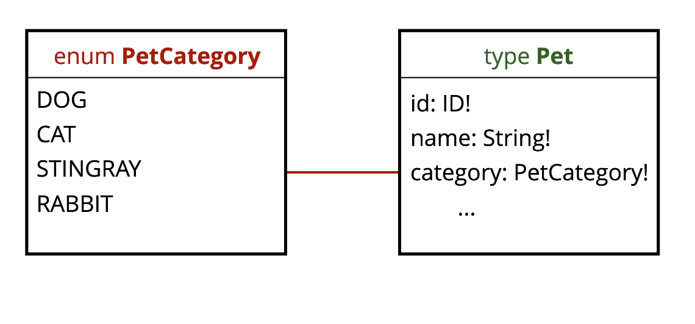
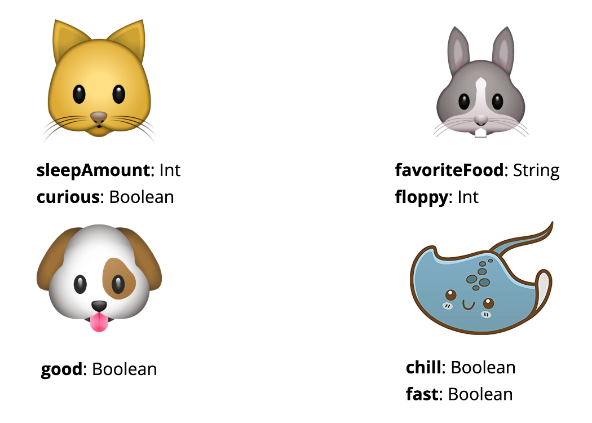
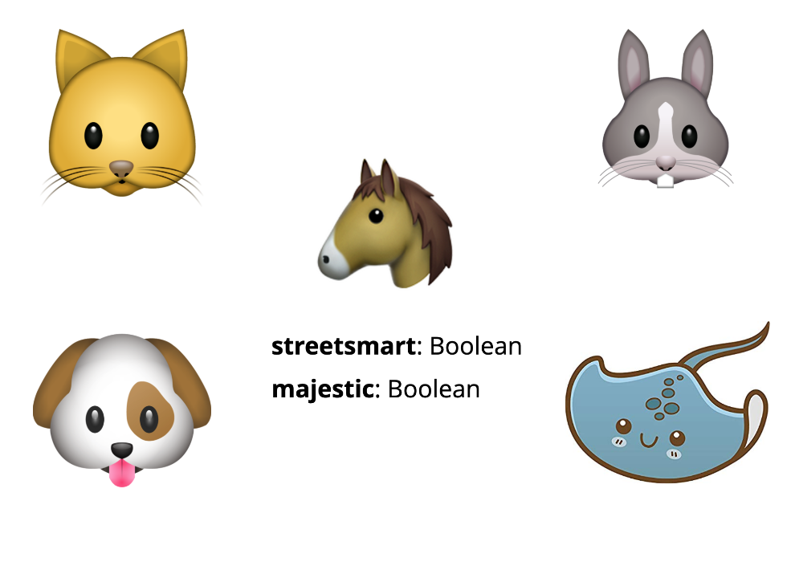

A GraphQL schema is a tool for communication across teams. When we work together to define a schema with the schema definition language, we're deciding how everyone using our API will consume the data. We want to make it as clear and simple as possible for consumers to send operations to our API without errors.

In this article, we'll step through the process of refactoring a schema to make it easier for users of the graph to get the data they need. We'll use the Pet Library API, a GraphQL API where you can check out pets like books. The schema we want to refactor can be accessed via the GraphQL Playground at [https://pet-library.moonhighway.com/](https://pet-library.moonhighway.com/). To start, let's send a query to see all of the pets at the library:

```graphql
query {
  allPets {
    id
    name
    category
  }
}
```

We can also add on to the query and get information about the total number of pets that are available. We'll also add arguments to the queries to see just the available pets:

```graphql
query {
  totalPets(status: AVAILABLE)
  allPets(status: AVAILABLE) {
    id
    name
    category
  }
}
```

If we look at the schema, we'll see that the `status` argument is nullable, or optional, for each query:

```graphql
type Query {
  totalPets(status: PetStatus): Int!
  allPets(category: PetCategory, status: PetStatus): [Pet!]!
}
```

This is not necessarily a bad thing, but the optional argument can be easy for the person writing the query to overlook. We also have to write GraphQL aliases in the query if we want to send the same query with different arguments. For example, if we wanted to see all available pets and all checked out pets, we'd have to prepend an alias onto those fields:

```graphql
query {
  available: totalPets(status: AVAILABLE)
  checkedOut: totalPets(status: CHECKEDOUT)
}
```

That's a lot of extra thinking that we're asking of our API users. To make our intentions more clear, we could instead create separate queries to handle pets being available or not. In a perfect world, we'd be able to make this happen. This blog is that perfect world!

We'll start with the schema:

```graphql
type Query {
  totalPets: Int!
  availablePets: Int!
  checkedOutPets: Int!
  allPets: [Pet!]!
  allAvailablePets: [Pet!]!
  allCheckedOutPets: [Pet!]!
}
```

Now we can go over to a different version of the Pet Library at [https://funded-pet-library.moonhighway.com/](https://funded-pet-library.moonhighway.com) to send the updated query. It's like the original Pet Library but now with more funding for better schema design:

```graphql
query {
  totalPets
  availablePets
  checkedOutPets
}
```

Now we don't have to use aliases or arguments, and it's more clear what data we're trying to access.

```graphql
query {
  allAvailablePets: [Pet!]!
  allCheckedOutPets: [Pet!]!
}
```

## Refactoring with Interfaces

Interfaces are another feature of the GraphQL Schema Definition Language that we can use to enhance our schema. Currently, our API supports a `Pet` type. We've been returning it from that `allPets` query:

```graphql
type Pet {
  id: ID!
  name: String!
  weight: Float
  category: PetCategory!
  status: PetStatus
  photo: Photo
  dueDate: Date
  inCareOf: Customer
}
```

Each `Pet` has a field called `petCategory` that returns an enum for `PetCategory` which is either a `CAT`, `DOG`, `STINGRAY`, or `RABBIT`:



But what happens if we wanted to add another animal type to the list like a `HORSE`. Or what if we wanted to add specific fields to a specific pet like a `good` boolean for every `DOG`:



Then when we add a `Horse` later, they can have their own fields too:



In that case, we might benefit from using an interface. To start refactoring this, we'll start with the main type that we want to reuse when creating new pets. The `Pet` interface will contain all of the fields that should be shared by every pet:

```graphql
interface Pet {
  id: ID!
  name: String!
  weight: Float
  status: PetStatus
  photo: Photo
  dueDate: Date
  inCareOf: Customer
}
```

Once I create the main `Pet`, I can then extend it for use by all of the different types.

```graphql
type Cat implements Pet {
  id: ID!
  name: String!
  weight: Float
  status: PetStatus
  photo: Photo
  dueDate: Date
  inCareOf: Customer
  sleepAmount: Int
  curious: Boolean
}

type Dog implements Pet {
  id: ID!
  name: String!
  weight: Float
  status: PetStatus
  photo: Photo
  dueDate: Date
  inCareOf: Customer
  good: Boolean
}

type Rabbit implements Pet {
  id: ID!
  name: String!
  weight: Float
  status: PetStatus
  photo: Photo
  dueDate: Date
  inCareOf: Customer
  favoriteFood: String
  floppy: Int
}

type Stingray implements Pet {
  id: ID!
  name: String!
  weight: Float
  status: PetStatus
  photo: Photo
  dueDate: Date
  inCareOf: Customer
  chill: Int
  fast: Boolean
}
```

It's important to note that when you create implementations of the interface you **must** add all of the fields from the `Pet` interface. This feels like an extra step, but it makes the schema easier to read and maintain when you're specific about which fields your data type uses.

Now when I query this data, I'll still be able to send the `allPets` query, but this time my syntax will look a bit different. Say I wanted to return data for pets but I wanted to return fields that are specific to stingrays in the query as well. We'll use a GraphQL inline fragment (`...`) to push the fields from the `Stingray` type into the query operation. We'll also add the `__typename` field to access the type for each returned object:

```graphql
query {
  allPets {
    __typename
    name
    weight
    ... on Stingray {
      chill
      fast
    }
  }
}
```

Then our response will look a bit like this:

```json
{
  "data": {
    "allPets": [
      {
        "__typename": "Cat",
        "name": "Biscuit",
        "weight": 10.2
      },
      {
        "__typename": "Dog",
        "name": "Danton",
        "weight": 50.4
      },
      {
        "__typename": "Stingray",
        "name": "Lazer",
        "weight": 15.7,
        "chill": 9,
        "fast": true
      },
      {
        "__typename": "Stingray",
        "name": "Switchblade",
        "weight": 20.7,
        "chill": 10,
        "fast": true
      },
      {
        "__typename": "Stingray",
        "name": "Pluto",
        "weight": 66.1,
        "chill": 6,
        "fast": false
      },
      {
        "__typename": "Rabbit",
        "name": "Pip",
        "weight": 3.7
      }
    ]
  }
}
```

Just the `name` and `weight` will be returned for all of the pet types and `chill` and `fast` will be returned for stingrays.

--

These tweaks to the schema might seem minor, but they go a long way in making our APIs easier to interact with. Incorporating interfaces and reducing arguments in favor of custom queries can make writing queries more pleasant and less error prone.

If you want to learn more about writing resolvers for interfaces, check out our article [Enhancing Schemas with Interfaces](https://moonhighway.com/enhancing-schemas-with-interfaces).
