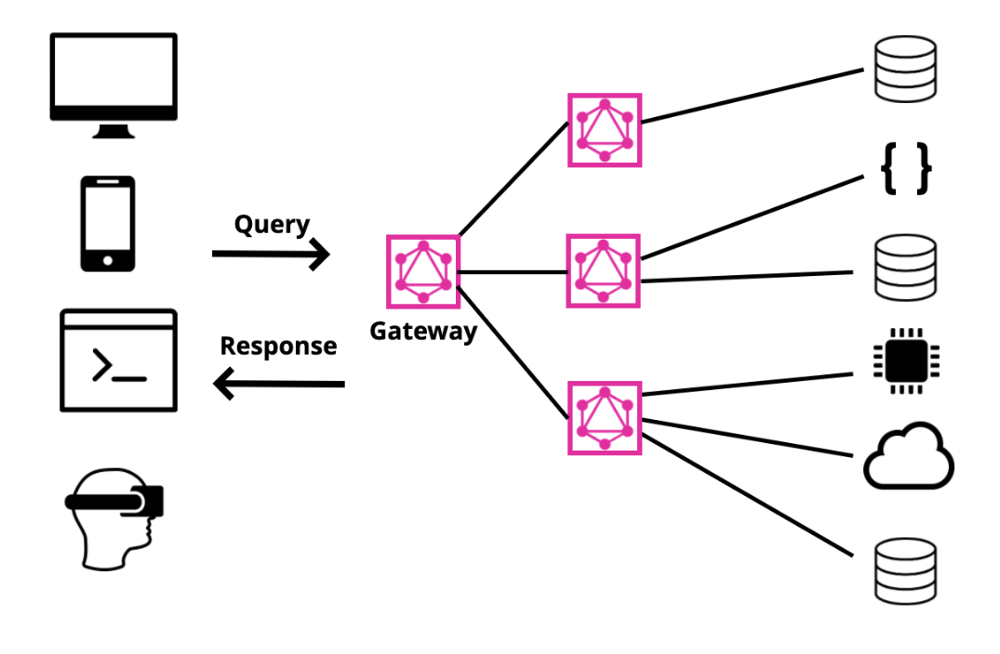

Apollo Federation is an open source architecture that is designed to help your organization implement and orchestrate GraphQL services at scale. That's a sentence with a lot of words, but why do we care? Why is it useful? In this article, we'll take a closer look at the Whys and the WTFs of Apollo Federation.

If you've built a GraphQL server before, you might know that a server really is two things: a schema that describes all of your API's types and a bunch of resolver functions that return data from databases, REST APIs, cloud services, wherever it is. A typical request and response to a GraphQL API looks like this. The client sends a query to the GraphQL server then the server collects data from the datasources and returns a response.


The architecture is a single request and a single response from a single schema. When teams manage a schema with a lot of types, it can become overwhelming. The schema can get rather large. This is where Apollo Federation might fit in. Instead of a single GraphQL server, we build a GraphQL gateway as a another layer between the client and multiple servers.



These servers often represent different parts of our domain and usually different types have their own server. For example, if we had an Accounts team, Colors team, and Reviews team, each would be able to manage their own area without having to communicate with each other.


Apollo Federation is often described as a way to scale your GraphQL APIs, and a big part of this is team management. The federated architecture allows a team to focus on their own types without being distracted by details of the domain that aren't pertinent to them.

So how does this work in practice? Let's consider an example with two types: a `Lift` and a `Trail` at our fake ski resort with a real GraphQL API: Snowtooth Mountain. At Snowtooth, we have a `Lift` team and a `Trail` team, and we want each to work separately. We do want both APIs to be queryable at a single location: the gateway.

To follow along with the code, you can find the project at [https://github.com/graphqlworkshop/snowtooth-federation-lab](https://github.com/graphqlworkshop/snowtooth-federation-lab). There are several branches for each step (step-1, step-2, step-3, step-4, & complete).

## Federating the Lift Service

To begin, we'll start in the main branch and run `npm i` which will install the dependencies in both the `lifts` and `trails` folders. Once installed, we'll navigate to the `lifts` directory and run:

```
cd lifts
npm i @apollo/federation apollo-server graphql
```

In the folder, we have all of the information about lifts. All of the queries and all of the types related to the `Lift` service. We'll need to make this service a **federated** service, so that the data from this service can be made available at the GraphQL gateway. This will involve some configuration of our our server in `lifts/index.js`. First, we'll import a function from the `@apollo/federation` package:

```javascript
const { buildFederatedSchema } = require('@apollo-federation');
```

Then we'll adjust our server constructor from this:

```javascript
const server = new ApolloServer({
  typeDefs,
  resolvers
});
```

To this:

```javascript
const server = new ApolloServer({
  schema: buildFederatedSchema({
    typeDefs,
    resolvers
  })
});
```

Notice that we're adding the schema key and passing our `typeDefs`, the schema, and the `resolvers` to the `buildFederatedSchema` function. Now if we run `npm start` in the `lifts` folder, this will run the service on `localhost:4001`. In the Docs panel, you'll notice a new query available. If we run the `_service` query, we can return a field called `sdl` which exposes our schema and all federation directives for consumption by the gateway.

```graphql
query {
  _service {
    sdl
  }
}
```

The documentation for the `sdl` field reads: _The sdl representing the federated service capabilities. Includes federation directives, removes federation types, and includes rest of full schema after schema directives have been applied._

You also may send lift queries to this service like an `allLifts` query for example:

```graphql
query {
  allLifts {
    name
    id
    status
  }
}
```

## Federating the Trail Service

Next, we need to do the same thing to the `trails` service. Again, you'll want to install `@apollo/federation`, `apollo-server`, and `graphql`:

```
cd ..
cd trails
npm i @apollo/federation apollo-server graphql
```

Then you'll import `buildFederatedSchema` and use it in the server constructor in the `trails/index.js` file:

```javascript
const { buildFederatedSchema } = require('@apollo/federation');

const server = new ApolloServer({
  schema: buildFederatedSchema({
    typeDefs,
    resolvers
  })
});
```

Now you'll run the trails service with `npm start` and see the GraphQL Playground running at `localhost:4002`.

For the purposes of this demo, you're running everything, but imagine these are two separate services, built by two separate teams concurrently. Once these are built and made compatible with federation, it's time to build the gateway!

## Creating the Gateway

One of the most fundamental concepts in GraphQL is that unlike REST which has a bunch of different endpoints, a GraphQL service has a single endpoint. Even though we have different services running on different ports, the GraphQL gateway's endpoint is this single endpoint in GraphQL. The gateway is where we'll send our queries.

Let's create the gateway in its own folder. At the root, next to the trails and lifts folder, we'll create a folder called `gateway` and install the necessary dependencies:

```
cd ..
mkdir gateway
cd gateway
npm init -y
npm install @apollo/gateway apollo-server graphql nodemon
```

Then we'll create an index.js and build the gateway here. First, require `ApolloServer` and `ApolloGateway` from the appropriate packages:

```javascript
const { ApolloServer } = require('apollo-server');
const { ApolloGateway } = require('@apollo/gateway');
```

Then we'll create a list of all of the services that we want to make available on the gateway: `lifts` and `trails`:

```javascript
const gateway = new ApolloGateway({
  serviceList: [
    { name: 'lifts', url: 'http://localhost:4001' },
    { name: 'trails', url: 'http://localhost:4002' }
  ]
});
```

Next we'll want to load the gateway and create a new Apollo Server that will run on port 4000:

```javascript
(async () => {
  const { schema, executor } = await gateway.load();

  const server = new ApolloServer({ schema, executor });

  server.listen(4000).then(({ url }) => {
    console.log(`🎿 Snowtooth Gateway available at ${url}`);
  });
})();
```

This immediately invoked function will start the server as soon as the file is run. Before we start the file, we can create an npm start script in the package.json to run `nodemon` everytime things change in the file:

```json
  "scripts": {
    "start": "nodemon ."
  }
```

With the gateway set up, make sure that both your trails and lifts services are running. Then start the gateway with `npm start` and open up `localhost:4000` to see the gateway's GraphQL Playground running. Now we can access all of the trail and lift data at this single route and can query all available fields:

```graphql
query {
  allLifts {
    name
    status
  }
  allTrails {
    name
    status
  }
}
```

This is very exciting. All of the data we want to be able to access is at one place, but we've pulled it all together from two separate APIs. Next, we want to connect the data types.

We need to adjust the `Trail` type in the Trail API and convert the Trail from a type to an **entity**. An entity is a type that can be extended into another service. In `trails/index.js`, make the `Trail` an entity:

```graphql
type Trail @key(fields: "id") {
  id: ID!
  name: String!
  status: TrailStatus!
  difficulty: Difficulty!
  groomed: Boolean!
  trees: Boolean!
  night: Boolean!
}
```

The `@key` directive will be used in order for other services to be able to reference or extend that type.

The `Trail` type should have a field called `liftAccess` to return all of the lifts that take you to a trail. Though it might feel tempting to add `liftAccess` to the Trail type in the `trails/index.js` file, anything related to lifts should be on the Lift API, so we'll adjust `lifts/index.js`. In the schema, we'll extend the trail type:

```graphql
extend type Trail @key(fields: "id") {
  id: ID! @external
  liftAccess: [Lift!]!
}
```

The `extend` keyword means that the `Trail` is an entity that's defined in a different service. The `id` field will be used to identify the type on the external service, marked with the `@external` directive. Think of the `id` as the lookup for the appropriate value.

To make this work, we'll need to write a resolver in the `lifts` resolvers. This is a trivial resolver to find the data based on the trail's id:

```javascript
Trail: {
  liftAccess: trail => lifts.filter(lift => lift.trails.includes(trail.id));
}
```

Now you should be able to send a query for all of the lifts that take you to the trails:

```graphql
query {
  allTrails {
    id
    name
    liftAccess {
      id
      name
      status
    }
  }
}
```

The finished version of this app lives at the [complete branch](https://github.com/graphqlworkshop/snowtooth-federation-lab/tree/complete) of the project if you'd like to check it out!

Apollo Federation is a fantastic way to scale out your GraphQL projects and your GraphQL teams. Companies large and small are making big bets on Apollo Federation, and since it's based on a [spec](https://www.apollographql.com/docs/federation/federation-spec/), you can use it with JavaScript or your favorite programming language.

To learn more about Apollo Federation, here's a list of great resources!

- [Apollo Federation - Apollo Docs](https://www.apollographql.com/docs/apollo-server/federation/introduction/)
- [egghead Playlist - Apollo Federation by Alex Banks](https://egghead.io/playlists/getting-started-with-apollo-federation-60ad0165)
- [Apollo Federation Blog](https://blog.apollographql.com/apollo-federation-f260cf525d21)
- [Managed Federation Blog](https://blog.apollographql.com/announcing-managed-federation-265c9f0bc88e)
- [Advanced Federation Features](https://www.apollographql.com/docs/apollo-server/federation/advanced-features/)
- [Migrating from Schema Stitching](https://www.apollographql.com/docs/apollo-server/federation/migrating-from-stitching/)
